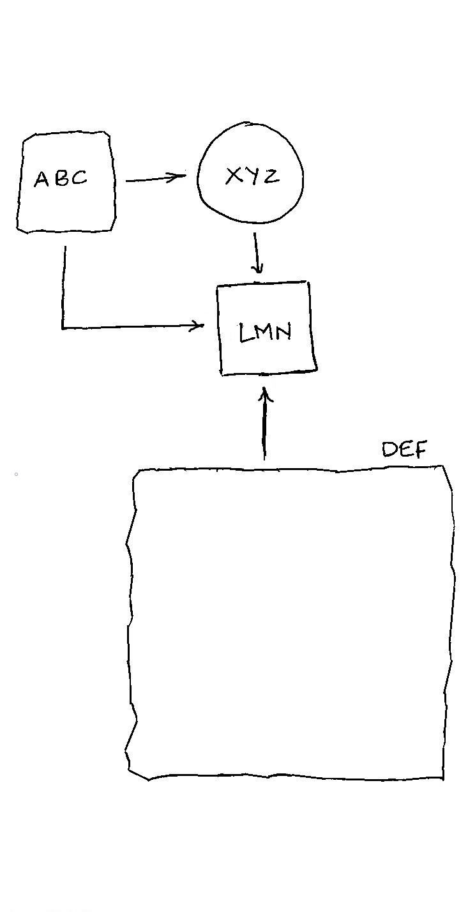
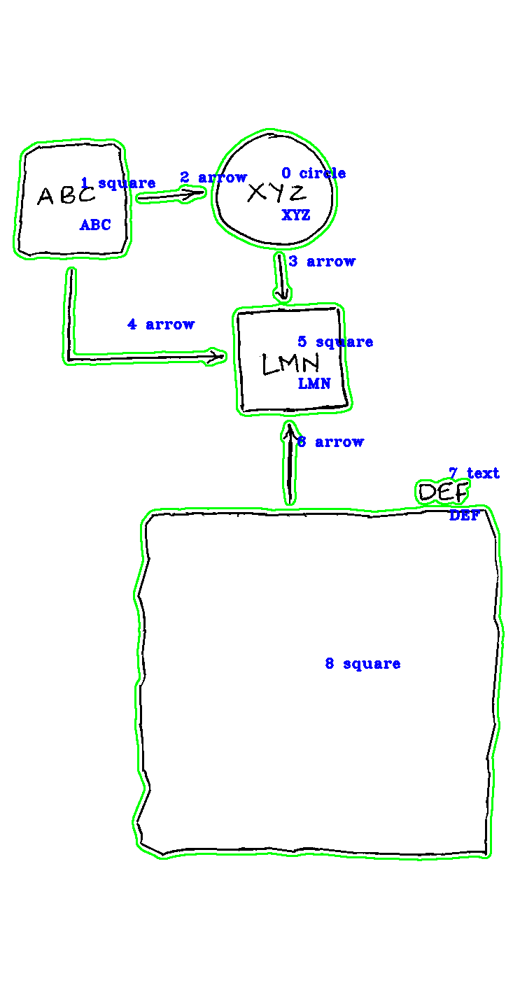

# HandWritten Flowchart Recognition with Flask Backend Service
 
 Sample Input Image

- command line: python flowchart_recognition.py "image file name" 
If image file name were not given, it'll be asking image file name

- GUI: python GUI.py

- flask backend service: python main.py

Result

| Id | Name | Position | Shape | Line |
| -- | ---- | -------- | ----- | ---- |
| 0 | xyz	| Inside | circle | LMN |
| 1 | ABC | Inside | square | XYZ, LMN |
| 5 | LMN | Inside | square | |
| 8 | DEF | Outside | square | LMN |

* Position: inside / outside
* Shape: triangle / square / circle
* Line: connected nodes to go

parameters:

- padding: the distance range between inside text and boundingRect of shapes
- offset: used to decide direction(AC or BD) of curved lines
- arrow: length of arrow

Output Image for Sample Input Image

